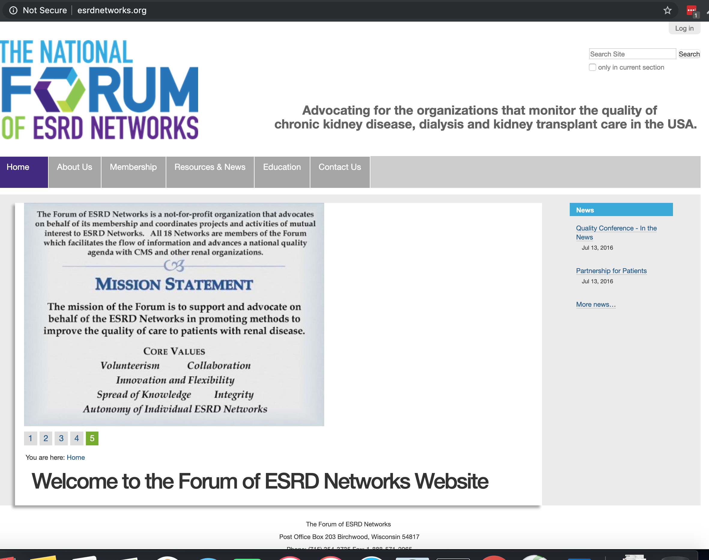

ESRD
====

Virtualenv
----------

Requires virtualenv==16.7.10 due to https://github.com/pypa/virtualenv/issues/1638

Ubuntu
------

::

    sudo apt-get update
    sudo apt-get install aptitude build-essential libjpeg-dev libxslt-dev \
        libreadline-dev                                                   \
        libsslcommon2-dev libssl-dev libtiff5-dev libjpeg8-dev            \
        libfreetype6-dev liblcms2-dev libwebp-dev libssl-dev libxml2-dev  \
        libxslt1-dev libbz2-dev nginx openssl python-dev tcl8.6-dev       \
        python-virtualenv                                                 \
        tk8.6-dev zlib1g-dev -y
    sudo aptitude update
    sudo aptitude upgrade -y

Plone
-----

::

    git clone git@github.com:ACLARKNET/ESRD.git
    sudo mv ESRD /srv/
    cd /srv/ESRD

NGINX
-----

::

    server {
        listen 80 default_server;
        listen [::]:80 default_server ipv6only=on;
        root /usr/share/nginx/html;
        index index.html index.htm;
        server_name localhost;
            try_files $uri $uri/ =404;
        location / {
            proxy_pass http://localhost:8080/VirtualHostBase/http/esrdnetworks.org:80/Plone/VirtualHostRoot/;
            proxy_http_version 1.1;
            proxy_set_header Upgrade $http_upgrade;
            proxy_set_header Connection 'upgrade';
            proxy_set_header Host $host;
            proxy_cache_bypass $http_upgrade;
        }
    }

EB
--

*wsgi*

::

    RewriteEngine On
    RewriteCond %{HTTP:X-Forwarded-Proto} !https
    RewriteCond %{HTTP_USER_AGENT} !ELB-HealthChecker
    RewriteRule (.*) https://%{HTTP_HOST}%{REQUEST_URI}

*ssl*

::

    RewriteEngine on
    RewriteRule ^/(.*) http://localhost:8080/\
        VirtualHostBase/http/%{HTTP_HOST}:80/Plone/VirtualHostRoot/$1 [P,L]

*/srv*

- https://aws.amazon.com/blogs/devops/customize-ephemeral-and-ebs-volumes-in-elastic-beanstalk-environments/

*py2.7*

::

    aws elasticbeanstalk update-environment --environment-name esrd-env-3 --solution-stack-name "64bit Amazon Linux 2018.03 v2.7.6 running Python 2.7" 

Debug
-----

To be run after ``eb ssh``.

::

    cd /opt/python/current && source ./env && cd app
